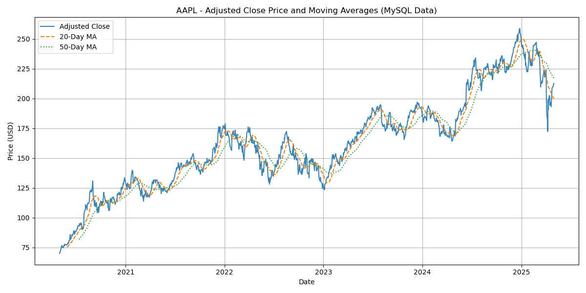

# Stock Market Trend Analysis (Python, SQL, Excel)

## Project Goal
To fetch historical stock data for major tech companies (AAPL, MSFT, GOOGL), store it persistently in a MySQL database, perform trend analysis (calculating moving averages), visualize the results, and create a summary report in Excel. This project demonstrates a full data analysis workflow from data acquisition to reporting.

## Tools Used
*   **Python:**
    *   `yfinance`: Data acquisition from Yahoo Finance API.
    *   `pandas`: Data manipulation and analysis.
    *   `sqlalchemy`: Connecting to and interacting with MySQL database.
    *   `mysql-connector-python`: MySQL driver.
    *   `matplotlib`: Data visualization (plotting).
    *   `openpyxl`: Writing data to Excel files.
*   **Database:** MySQL (via MySQL Workbench for setup/inspection).
*   **Reporting:** Microsoft Excel (for enhanced reporting, charts, and PivotTables).
*   **Environment:** Jupyter Notebook.

## Process/Workflow
1.  **Data Acquisition:** Fetched 5 years of historical daily stock data (Open, High, Low, Close, Volume, Adjusted Close) for AAPL, MSFT, and GOOGL using the `yfinance` library.
2.  **Database Storage:** Established a connection to a local MySQL database using SQLAlchemy and stored the fetched data in a structured table (`daily_stock_data`), handling potential duplicates with a primary key constraint.
3.  **Data Loading & Analysis:** Queried the MySQL database using Python to load data into pandas DataFrames. Calculated 20-day and 50-day simple moving averages (SMA) for the adjusted closing price.
4.  **Visualization:** Generated line plots for each stock using Matplotlib, visualizing the adjusted closing price against its calculated moving averages. Plots were saved as PNG files.
5.  **Reporting:**
    *   Exported the processed data (adjusted close, MAs) to an Excel file (`stock_analysis_report_mysql.xlsx`) with separate sheets per stock.
    *   Enhanced the Excel report with formatting, a summary sheet calculating key metrics (recent price, average price, volatility), PivotTables summarizing data (e.g., average price by year), a comparative stock price chart, and written insights.

## Key Features & Findings
*   Successfully integrated Python, MySQL, and Excel for an end-to-end analysis pipeline.
*   Demonstrated persistent storage of time-series data in a relational database.
*   Calculated key performance and volatility metrics.
*   MSFT showed strong growth while being the least volatile of the three stocks analyzed over the period. 
*   Visualized price trends and moving average indicators (see example plot below).

## How to Run
1.  **Prerequisites:**
    *   Python 3 installed.
    *   MySQL Server installed and running.
    *   MySQL Workbench (optional, for inspection).
2.  **Clone Repository:** `git clone [https://github.com/vikas0127/Stock-Analysis-MySQL-Python-Excel]` 
3.  **Install Libraries:** `pip install -r requirements.txt` (or `pip install pandas yfinance sqlalchemy mysql-connector-python matplotlib openpyxl`)
4.  **Setup Database:**
    *   Using MySQL Workbench or command line, connect to your MySQL server.
    *   Create the database: `CREATE DATABASE IF NOT EXISTS stock_market_db;`
5.  **Configure Credentials:**
    *   Rename or copy `config.py`.
    *   Edit `config.py` and replace the placeholder values for `MYSQL_USER` and `MYSQL_PASSWORD` with your actual MySQL credentials. (Note: `yfinance` doesn't require an API key).
6.  **Run Jupyter Notebook:**
    *   Launch Jupyter Notebook (`jupyter notebook`).
    *   Open `Stock_Analysis_Notebook.ipynb`.
    *   Run the cells sequentially (Kernel -> Restart & Run All).
7.  **Check Outputs:** Outputs (plots, Excel file) will be generated in the `output_mysql` folder (relative to the notebook location).
